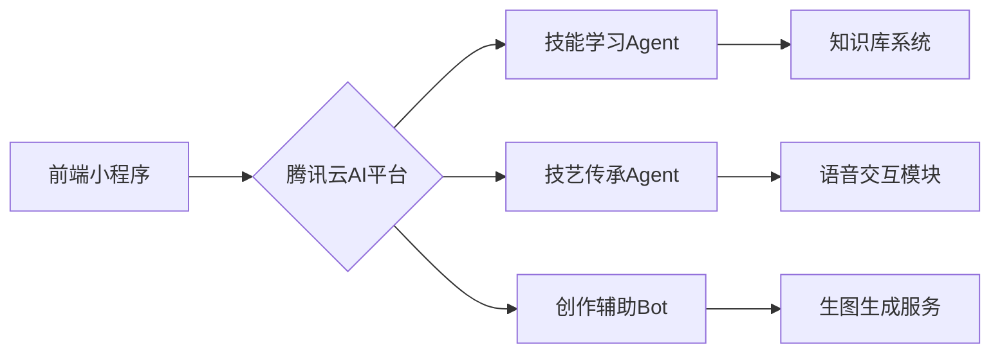

# 红尘灵境AI助手接入方案

## 项目背景
为红尘灵境项目接入腾讯云AI小程序成长计划，获取AI开发资源支持。

## 接入方案

### 1. 平台选择
- **主平台**: 腾讯云智能体开发平台
- **备用平台**: OpenClaw (龙虾AI)

### 2. 功能规划
- **技能学习助手**: 基于LangGraph构建技能学习工作流
- **技艺传承Agent**: 集成语音交互与知识库功能
- **创作辅助Bot**: 结合生文/生图模型生成教学素材

### 3. 资源申请
- **Token申请**: 1亿混元Token用于模型推理
- **生图配额**: 1万张/月用于教学素材生成
- **计算资源**: 申请GPU加速实例支持模型微调

### 4. 技术架构
